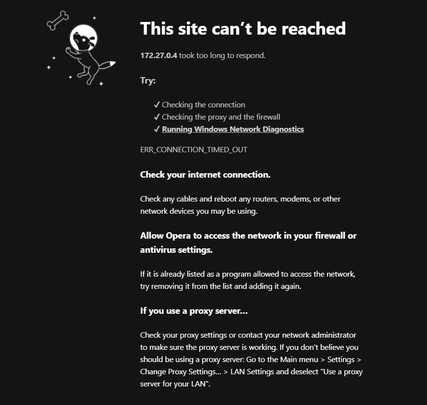

# Documentation of trial and error of Docker part

## Info

- My Api and Maui app works wihtout the docker
- ADD VIDEO HERE
- the problem at the moment is that with the dockerization of the Api and mysql server
- I also followed the canvas video for the ASP API

### What had i tried before
- I tried the video's on canvas, online videos, chatgbt, etc but it mostly came down to the same problem that the containers started running succesfully but that i could not use the url
  - for example the url of the docker api is: `http://localhost:8000``
  - when i use that url with my api route `api/todo` it gave a connection error

### What now?
- I am trying againf ollowing the video on canvas again an hopefully finding my error. 

## Start of dockerization

### Step 1:
#### docker files and composing
  - I created the necesary docker files and ran the `docker-compose up` command
  - the container are running succesfully:
  - 
  - the problem i see is that i define the host and port `8000:80` but the container oes to 8080
  - why this is, I dont now but i will try and fix this
  - chanegd the port to 8080:80 but not i get a `ERR_EMPTY_RESPONSE` error in the browser
  - the problem still returns even if i tellt he api to run on ``http://0.0.0.0:80` using this line `app.Run("http://0.0.0.0:80");`
  - 